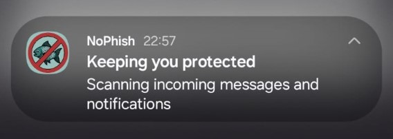
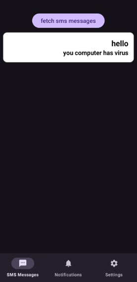
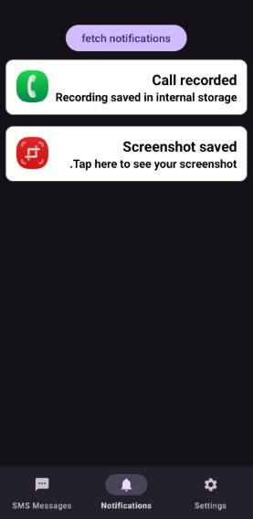
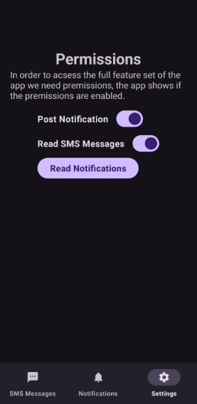

# NoPhish App - SMS & Notification Phishing Detection


## Overview

Phishing prevention tool for Android, as part of my Final Project.

You can find the backend repo [here](https://github.com/lordYorden/NoPhish-server)

## Features

- **Real-time SMS Monitoring**: Automatically captures and analyzes incoming SMS messages
- **Notification Monitoring**: Monitors push notifications from all installed apps
- **Foreground Service**: Runs continuously in the background to ensure protection
- **Data Upload**: Sends collected data to backend API for phishing analysis
- **User-friendly Interface**: Simple navigation with multiple screens for different functionalities

## App Architecture

### Foreground Service Logic

The app uses a **Foreground Service** (`UploadForegroundService`) that runs continuously to:

1. **Monitor incoming messages**: Captures SMS messages and notifications in real-time
2. **Process data**: Extracts relevant information (sender, content, timestamp, package name)
3. **Upload to API**: Sends data to the backend server for phishing analysis
4. **Maintain persistence**: Keeps running even when the app is not in the foreground

#### Service Workflow:

- Service starts when a new SMS or notification is received
- Data is bundled and passed to the service
- Service creates appropriate API calls (SMS or Notification endpoints)
- Maintains a persistent notification to inform user of active protection


### Key Components:

- **UploadForegroundService**: Main background service for data processing
- **SmsBroadcastReceiver**: Captures incoming SMS messages
- **NotificationReceiverService**: Monitors system notifications
- **Retrofit Controllers**: Handle API communication (SmsController, NotificationController)

## Permissions Required

The app requires the following permissions for proper functionality:

### Critical Permissions:

- **`READ_SMS`** - Read incoming SMS messages for analysis
- **`RECEIVE_SMS`** - Receive SMS message broadcasts
- **`FOREGROUND_SERVICE`** - Run background monitoring service

### Additional Permissions:

- **`POST_NOTIFICATIONS`** - Display status notifications to user
- **`RECEIVE_BOOT_COMPLETED`** - Auto-start protection after device reboot
- **`QUERY_ALL_PACKAGES`** - Monitor notifications from all installed apps

### Special Permissions:

- **Notification Listener Service** - Required to monitor system notifications

## App Screens

The app features a bottom navigation interface with the following screens:

### 1. **SMS Fragment**


- Displays collected SMS messages
- Shows sender information and message content
- Allows filtering by phone number
- Pagination support for large datasets

### 2. **Notifications Fragment**


- Lists monitored push notifications
- Shows app package names and notification content
- Real-time updates of incoming notifications

### 3. **Settings Fragment**


- Permission management and status
- Service configuration options
- API endpoint configuration
- App preferences and controls

## Quick Start Guide

### Prerequisites

- Android device running API level 26 (Android 8.0) or higher
- Internet connection for API communication

### Installation & Setup

1. **Install the APK**

   - download in github release
2. **Grant Required Permissions**

   - Launch the app and goto settings screen
   - Enable SMS and Notification permissions
   - Grant notification access in settings screen
3. **API Configuration**

   - Update the API endpoint in `Constants.kt` (see configuration section below)
   - Ensure backend server is running and accessible

### Building from Source

1. **Configure API Endpoint**

   - Edit `app/src/main/java/dev/lordyorden/as_no_phish_detector/utilities/Constants.kt`
   - Update the `BASE_URL` constant with your API endpoint
2. **Open in Android Studio**

   - Open Android Studio
   - Select "Open an existing project"
   - Navigate to the NoPhish-App folder
   - Wait for Gradle sync to complete
3. **Run the app**

   - Connect your Android device or start an emulator
   - Click the "Run" button (▶️) in Android Studio
   - The app will be built and installed automatically

## API Configuration

### Setting up the Backend Endpoint

To configure the API endpoint, modify the `Constants.kt` file:

```kotlin
// File: app/src/main/java/dev/lordyorden/as_no_phish_detector/utilities/Constants.kt

class Constants {
    object RestAPI{
        const val BASE_URL = "YOUR_API_ENDPOINT_HERE"  // Replace with your server URL
    }
  
    object Perms {
        const val POST_NOTIFICATION_CODE = 42
        const val READ_NOTIFICATION_CODE = 43
        const val READ_SMS_CODE = 44
    }
}
```

### Local Development with ngrok (Recommended)

For local backend testing, we **highly recommend using ngrok** to expose your local server:

* **Install ngrok** **from** [https://ngrok.com/download](https://ngrok.com/download)
* **Start your Python backend server** (on port default 8000)

  ```bash
  # Start the FastAPI/Uvicorn backend
  uvicorn main:app
  ```
* **Copy ngrok start command**

  ```bash
  ngrok http --url=abc123.ngrok-free.app 8000
  ```
* **Update Constants.kt with ngrok URL**
* ```kotlin
  const val BASE_URL = "https://abc123.ngrok-free.app"
  ```

### API Endpoints

The app communicates with the following endpoints:

- **POST `/messages`** - Upload SMS messages
- **GET `/messages`** - Retrieve SMS messages (paginated)
- **GET `/messages/{messageId}`** - Get specific SMS message
- **GET `/messages/byNumber/{phoneNumber}`** - Get messages by phone number
- **POST `/notifications`** - Upload notification data

### Backend Requirements

Your backend server should handle:

- SMS message data with fields: `address`, `body`, `timestamp`
- Notification data with fields: `title`, `body`, `packageName`, `timestamp`
- Proper CORS configuration for mobile app requests
- SSL/TLS encryption for secure data transmission

## Development Notes

- Built with **Kotlin** and **Android SDK**
- Uses **Retrofit** for API communication
- Implements **Navigation Component** for UI navigation
- **ViewBinding** for UI component access
- **ViewModel** architecture for data management

## Troubleshooting

### Common Issues:

1. **Service not starting**: Check if all required permissions are granted
2. **No data upload**: Verify API endpoint configuration and internet connectivity
3. **Notifications not detected**: Ensure notification listener permission is enabled
4. **SMS not captured**: Confirm SMS permissions are granted

### Debug Steps:

1. Check app logs using `adb logcat`
2. Verify service is running in Settings → Apps → NoPhish → Battery
3. Test API connectivity manually
4. Restart the service from app settings
